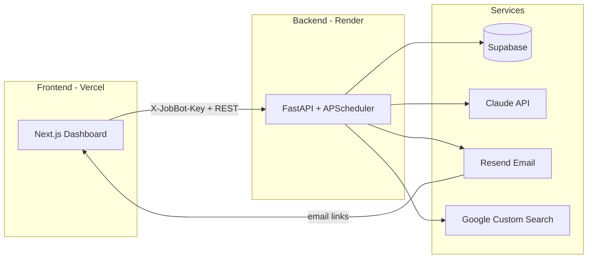

<p align="center">
  <strong>JobBot AI v2.0</strong><br />
  <em>Your personal 24/7 AI-powered job search agent</em>
</p>

<p align="center">
  
  
  
  
</p>

---

## What is JobBot?

JobBot AI automates the grind of job hunting for students and early-career engineers:

| Module | What it does |
|--------|----------------|
| **Job discovery** | Scrapes listings (internships, full-time) and scores match + fraud risk |
| **Web search** | Google Custom Search on Greenhouse & Lever boards |
| **Applications** | Track pipeline, follow-ups, and AI-tailored resumes |
| **Interview prep** | Claude-generated guides, practice Q&A, and grading |
| **Competitions** | Hackathons and coding contests matched to your profile |
| **Email alerts** | Resend-powered job, competition, and digest emails with dashboard links |
| **Vault** | Secure document storage for certificates and offer letters |

The dashboard is **passcode-protected** (single-user) and works on **desktop and mobile**.

---

## Architecture



---

## Project structure

```
jobbot/
├── backend/          # FastAPI API, scrapers, scheduler, email templates
│   ├── main.py
│   ├── routers/
│   ├── services/
│   ├── templates/    # HTML emails (use DASHBOARD_URL)
│   └── render.yaml   # Render deploy blueprint
└── frontend/         # Next.js 14 dashboard
    ├── src/
    │   ├── components/
    │   ├── pages/
    │   └── lib/api.js
    └── vercel.json
```

---

## Prerequisites

- **Node.js** 18+ and **npm**
- **Python** 3.11+
- Accounts: [Supabase](https://supabase.com), [Anthropic](https://console.anthropic.com), [Resend](https://resend.com)
- Optional: [Google Cloud](https://console.cloud.google.com) + [Programmable Search Engine](https://programmablesearchengine.google.com) for web job discovery

---

## Local development

### 1. Backend

```powershell
cd backend
python -m venv .venv
.\.venv\Scripts\Activate.ps1
pip install -r requirements.txt
copy .env.example .env
# Edit .env — see Environment variables below
uvicorn main:app --reload --host 0.0.0.0 --port 8000
```

- API root: http://localhost:8000  
- Health: http://localhost:8000/health  

### 2. Frontend

```powershell
cd frontend
npm install
copy .env.example .env.development
# Edit .env.development
npm run dev
```

- Dashboard: http://localhost:3000  

### 3. Unlock the dashboard

Set the **same secret** in both places:

| File | Variable |
|------|----------|
| `backend/.env` | `X_JOBBOT_KEY` |
| `frontend/.env.development` | `NEXT_PUBLIC_UI_ACCESS_KEY` |

Or enter the passcode on the lock screen (stored in `localStorage`).

---

## Environment variables

### Backend (`backend/.env`)

| Variable | Required | Description |
|----------|----------|-------------|
| `SUPABASE_URL` | Yes | Supabase project URL |
| `SUPABASE_SERVICE_KEY` | Yes | Service role key (server only) |
| `ANTHROPIC_API_KEY` | Yes | Claude API for scoring, resume, interview |
| `RESEND_API_KEY` | Yes | Transactional email |
| `FROM_EMAIL` | Yes | Verified sender in Resend |
| `X_JOBBOT_KEY` | Yes | API auth header secret |
| `DASHBOARD_URL` | Yes | Frontend URL for **email links** (`http://localhost:3000` local, Vercel URL in prod) |
| `CORS_ORIGINS` | Prod | Comma-separated allowed origins, e.g. `https://your-app.vercel.app` (use `*` only for dev) |
| `GOOGLE_SEARCH_API_KEY` | Optional | Google Cloud API key (Custom Search API enabled) |
| `GOOGLE_SEARCH_CX` | Optional | Programmable Search engine ID |
| `PORT` | Auto | `8000` locally; Render sets `$PORT` |

### Frontend (`.env.development` local / Vercel prod)

| Variable | Required | Description |
|----------|----------|-------------|
| `NEXT_PUBLIC_SUPABASE_URL` | Yes | Same project as backend |
| `NEXT_PUBLIC_SUPABASE_ANON_KEY` | Yes | Anon/public key only |
| `NEXT_PUBLIC_API_URL` | Yes | **Must end with `/api`** — e.g. `http://localhost:8000/api` or `https://your-backend.onrender.com/api` |
| `NEXT_PUBLIC_UI_ACCESS_KEY` | Yes | Same value as `X_JOBBOT_KEY` |

> Never commit `.env` files or expose service role / API keys in the frontend.

---

## Google Custom Search setup

1. **Google Cloud** → enable **Custom Search API** → create API key → restrict to Custom Search API.  
2. **Programmable Search** → create engine **JobBot Jobs** with sites `*.greenhouse.io/*` and `*.lever.co/*` (add separately).  
3. Copy **Search engine ID** → `GOOGLE_SEARCH_CX`.  
4. Set both vars in `backend/.env` and Render.

Without these, web search is skipped; other scrapers still run.

---

## Production deployment

### Backend — Render

1. Connect repo → use `backend/render.yaml` or create a **Web Service** (Python).  
2. **Root directory:** `backend`  
3. **Build:** `pip install -r requirements.txt`  
4. **Start:** `uvicorn main:app --host 0.0.0.0 --port $PORT`  
5. Set all env vars from the table above.  
6. **Important:**
   - `DASHBOARD_URL` = your Vercel URL (no trailing slash)  
   - `CORS_ORIGINS` = same Vercel URL  
   - `X_JOBBOT_KEY` = strong random secret  

Health check path: `/health`

### Frontend — Vercel

1. Import repo → **Root directory:** `frontend`  
2. Framework: Next.js (auto-detected)  
3. Environment variables (Production):

```env
NEXT_PUBLIC_API_URL=https://YOUR-BACKEND.onrender.com/api
NEXT_PUBLIC_SUPABASE_URL=https://YOUR_PROJECT.supabase.co
NEXT_PUBLIC_SUPABASE_ANON_KEY=eyJ...
NEXT_PUBLIC_UI_ACCESS_KEY=same_as_X_JOBBOT_KEY
```

4. Deploy → open site → enter access key if prompted.

---

## Pre-deploy checklist

Use this before every release:

- [ ] `NEXT_PUBLIC_API_URL` ends with `/api`  
- [ ] `NEXT_PUBLIC_UI_ACCESS_KEY` === `X_JOBBOT_KEY` on Render  
- [ ] `DASHBOARD_URL` points to live Vercel URL (not localhost)  
- [ ] `CORS_ORIGINS` includes Vercel URL  
- [ ] Google keys set on Render (if using web search)  
- [ ] `GET https://YOUR-BACKEND.onrender.com/health` returns `"database": "connected"`  
- [ ] Unlock dashboard and run **Scan Jobs Now** once  
- [ ] Test on a phone: menu, bottom nav, job cards scroll  

---

## API authentication

All `/api/*` routes require header:

```http
X-JobBot-Key: <your secret>
```

The frontend sends this automatically via `src/lib/api.js` (env var or lock-screen passcode).

---

## Mobile experience

The UI is responsive:

- **Hamburger menu** + slide-out sidebar on small screens  
- **Bottom navigation** (Home, Jobs, Apps, Profile)  
- **Touch-friendly** inputs and scrollable tables/charts  
- **Safe area** padding for notched phones  

Test with Chrome DevTools → device toolbar or a real phone on the same network.

---

## Email links (`DASHBOARD_URL`)

Backend emails (job alerts, competitions, interview ready, weekly digest) embed links like:

- `{DASHBOARD_URL}/jobs`  
- `{DASHBOARD_URL}/applications`  
- `{DASHBOARD_URL}/interview/{jobId}`  

If `DASHBOARD_URL` is still `http://localhost:3000` in production, email links will be wrong.

---

## Troubleshooting

| Symptom | Fix |
|---------|-----|
| **403 Unauthorized** | Match `X_JOBBOT_KEY` and `NEXT_PUBLIC_UI_ACCESS_KEY`; clear `localStorage` and re-unlock |
| **Network error / CORS** | Set `CORS_ORIGINS` on Render to your Vercel domain |
| **API 404** | `NEXT_PUBLIC_API_URL` must include `/api` suffix |
| **Web search skipped** | Set `GOOGLE_SEARCH_API_KEY` + `GOOGLE_SEARCH_CX`; restart backend |
| **Google 403** | Enable Custom Search API; check key restrictions and daily quota |
| **Emails not sending** | Verify Resend domain / `FROM_EMAIL` |

---

## License

Private / personal use — adjust as needed for your deployment.

---

<p align="center">
  Built for autonomous career ops — scan, apply, prep, repeat.
</p>
